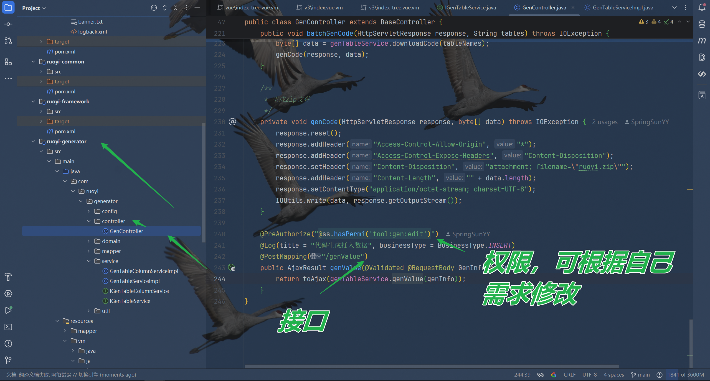
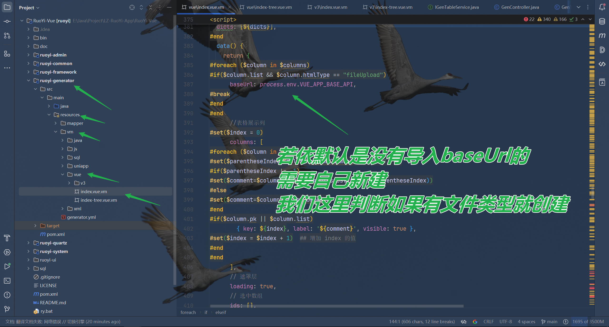

# LZ-RuoYi-App

RuoYi-App代码生成器，在RuoYi-App、RuoYi-Vue上进行二次开发——[LZ-RuoYi-App](https://github.com/SpringSunYY/LZ-RuoYi-App)，你也可以根据文档教程自行实现。

**详细实现功能可看个版本功能介绍**


#### LZ-RuoYi-App-v2.**介绍：

1. 实现SQL批量插入表数据

2. 实现表格当内容过长被隐藏时显示 tooltip

3. 实现在表格直接下载文件

4. 实现表格动态显隐列

   > 注：实现的功能，在每个版本下有展示效果已经实现教程

   

#### LZ-RuoYi-App-v1.**介绍：

其中也新做了一些组件，比如文件上传、图片上传、图片预览，集成富文本等组件，下载即可自己使用。

方便自己在做一些app的时候，可以生成一些基本的数据进行管理，不用自己新写页面。

1. uniapp生成单表增删改查
2. uniapp生成树表增删改查
3. 文件上传、图片上传、图片预览、富文本、dict-tag等组件

> 注：实现的功能，在每个版本下有展示效果已经实现教程

#  LZ-RuoYi-App-v2.0.0

1. 实现SQL批量插入表数据
2. 实现表格当内容过长被隐藏时显示 tooltip
3. 实现在表格直接下载文件
4. 实现表格动态显隐列

### 效果展示

#### 1、SQL批量插入

数据插入的字段同若依配置一样，当你选择是插入字段就可以插入这个字段的内容。


#### 2、显示 tooltip


#### 3、下载文件


#### 4、表格动态显隐列


### 自行实现教程

注：2-4实现方法如果不要看可在最后有生成的vm，直接粘贴全部替换也行。建议自己直接粘贴，想查看修改的地方可以看教程。粘贴内容放在教程第五点。

#### 1、SQL批量插入

1. 创建**genValue**方法：

   ```java
       /**
        * 批量插入数据
        *
        * @param genInfo
        * @return
        */
       int genValue(GenInfo genInfo);
   ```

   

2. 实现**genValue**方法：

   ```java
       @Override
       public int genValue(GenInfo genInfo) {
           Long genNumbers = genInfo.getGenNumbers();
           List<GenInfo.Column> tableColumnValues = genInfo.getTableColumnValues();
           String tableName = genInfo.getTableName();
           StringBuilder sql = new StringBuilder();
           StringBuilder columns = new StringBuilder();
   
           // 构建列名部分
           sql.append("INSERT INTO ").append(tableName).append(" (");
           for (int i = 0; i < tableColumnValues.size(); i++) {
               GenInfo.Column column = tableColumnValues.get(i);
               columns.append(column.getColumnName());
               if (i < tableColumnValues.size() - 1) {
                   columns.append(", ");
               }
           }
           sql.append(columns).append(") VALUES ");
   
           // 构建值部分
           for (int i = 0; i < genNumbers; i++) {
               StringBuilder values = new StringBuilder();
               values.append("(");
               for (int j = 0; j < tableColumnValues.size(); j++) {
                   GenInfo.Column column = tableColumnValues.get(j);
                   String value = column.getValue();
   
                   //如果是主键
                   if (column.isPk()) {
                       value = String.valueOf(IdUtils.snowflakeId());
                   }
   
                   // 如果字段是唯一的，添加去重逻辑（如加上当前遍历的 i）
                   if (column.getIsSole() == 1) {
                       value = value + "_" + i; // 加上当前遍历的 i 来防止重复
                   }
                   //添加数据
                   if (StringUtils.isNotEmpty(value)) {
                       values.append("'").append(value).append("'");
                   }else {
                       values.append(value);
                   }
   
                   if (j < tableColumnValues.size() - 1) {
                       values.append(", ");
                   }
               }
               values.append(")");
   
               if (i < genNumbers - 1) {
                   values.append(", ");
               }
   
               sql.append(values);
           }
   
           sql.append(";");
           String sqlString = sql.toString();
           try {
               return genTableMapper.createTable(sqlString);
           } catch (Exception e) {
               System.out.println( e.getMessage());
               throw new RuntimeException("生成数据失败，请检查数据是否符合数据库内容！！！");
           }
       }
   ```

   

3. 创建接口：

   ```java
       @PreAuthorize("@ss.hasPermi('tool:gen:edit')")
       @Log(title = "代码生成插入数据", businessType = BusinessType.INSERT)
       @PostMapping("/genValue")
       public AjaxResult genValue(@Validated @RequestBody GenInfo genInfo) {
           return toAjax(genTableService.genValue(genInfo));
       }
   ```

   

4. 创建批量插入SQL页面的路由：

   ```js
   ,
     {
       path: '/tool/gen-add-value',
       component: Layout,
       hidden: true,
       permissions: ['tool:gen:edit'],
       children: [
         {
           path: 'index/:tableId(\\d+)',
           component: () => import('@/views/tool/gen/genValue'),
           name: 'GenAddValue',
           meta: { title: '生成表数据', activeMenu: '/tool/gen' }
         }
       ]
     }
   ```

   

6. 创建genValue页面：

   ```vue
   <template>
     <el-card>
       <el-tabs :tab-position="tabPosition" type="border-card" style="margin-bottom: 30px;min-height: 600px">
         <el-tab-pane
           v-for="(column,index) in columns"
           :key="column.columnId"
           :name="column.columnName"
           v-if="!column.pk"
         >
           <span slot="label"><svg-icon v-if="column.required" icon-class="star" style="color: red"/> {{
               column.columnName
             }}</span>
           <el-form :ref="'form' + index" :model="tableColumnValues[index]" label-width="80px" size="mini"
                    style="width: 500px; margin: 0 auto;"
           >
             <el-form-item label="字段名称">
               <span>{{ tableColumnValues[index].columnName }}</span>
             </el-form-item>
             <el-form-item label="字段描述">
               <span>{{ tableColumnValues[index].columnComment }}</span>
             </el-form-item>
             <el-form-item label="物理类型">
               <span> {{ tableColumnValues[index].columnType }}</span>
             </el-form-item>
             <el-form-item label="Java类型">
               <span>{{ tableColumnValues[index].javaType }}</span>
             </el-form-item>
             <el-form-item label="Java属性">
               <span>{{ tableColumnValues[index].javaField }}</span>
             </el-form-item>
             <el-form-item label="是否唯一">
               <el-radio-group v-model="tableColumnValues[index].isSole">
                 <el-radio :label="0">否</el-radio>
                 <el-radio :label="1">是</el-radio>
               </el-radio-group>
             </el-form-item>
             <el-form-item v-if="column.htmlType==='textarea'"
                           label="生成数值"
                           :rules="[
                         { required: column.required, message: `${column.columnComment} 不能为空`, trigger: 'blur' }
                       ]"
             >
               <el-input v-model="tableColumnValues[index].value" type="textarea" placeholder="请输入生成数值"/>
             </el-form-item>
             <el-form-item v-if="column.htmlType==='datetime'"
                           label="生成数值"
                           :rules="[
                         { required: column.required, message: `${column.columnComment} 不能为空`, trigger: 'blur' }
                       ]"
             >
               <el-date-picker clearable
                               v-model="tableColumnValues[index].value"
                               type="date"
                               value-format="yyyy-MM-dd"
                               placeholder="请选择日期"
               >
               </el-date-picker>
             </el-form-item>
             <el-form-item v-if="column.htmlType==='imageUpload'"
                           label="生成数值"
                           :rules="[
                         { required: column.required, message: `${column.columnComment} 不能为空`, trigger: 'blur' }
                       ]"
             >
               <image-upload v-model="tableColumnValues[index].value"/>
             </el-form-item>
             <el-form-item v-if="column.htmlType==='fileUpload'"
                           label="生成数值"
                           :rules="[
                         { required: column.required, message: `${column.columnComment} 不能为空`, trigger: 'blur' }
                       ]"
             >
               <file-upload v-model="tableColumnValues[index].value"/>
             </el-form-item>
             <el-form-item v-if="column.htmlType==='editor'"
                           label="生成数值"
                           :rules="[
                         { required: column.required, message: `${column.columnComment} 不能为空`, trigger: 'blur' }
                       ]"
             >
               <editor v-model="tableColumnValues[index].value"/>
             </el-form-item>
             <el-form-item
               label="生成数值"
               :rules="[
                         { required: column.required, message: `${column.columnComment} 不能为空`, trigger: 'blur' }
                       ]"
             >
               <el-input v-model="tableColumnValues[index].value" placeholder="请输入生成数值"/>
             </el-form-item>
           </el-form>
           {{ tableColumnValues[index] }}
         </el-tab-pane>
       </el-tabs>
       <el-form label-width="1000px" :inline="true" class="demo-form-inline">
         <el-form-item label="生成总数">
           <el-input-number :min="1" v-model="genInfo.genNumbers" placeholder="请输入生成总数"></el-input-number>
         </el-form-item>
         <el-form-item>
           <el-button type="primary" @click="submitForm()">提交</el-button>
           <el-button @click="close()">返回</el-button>
         </el-form-item>
       </el-form>
     </el-card>
   </template>
   
   <script>
   import { getGenTable, genValue } from '@/api/tool/gen'
   import { optionselect as getDictOptionselect } from '@/api/system/dict/type'
   import { listMenu as getMenuTreeselect } from '@/api/system/menu'
   import basicInfoForm from './basicInfoForm'
   import genInfoForm from './genInfoForm'
   
   export default {
     name: 'GenEdit',
     components: {
       basicInfoForm,
       genInfoForm
     },
     data() {
       return {
         //生成信息
         genInfo: {
           tableName: {},
           genNumbers: 1,
           tableColumnValues: []
         },
         tabPosition: 'top',
         //生成字段数据
         tableColumnValues: [],
         // 选中选项卡的 name
         activeName: 'columnInfo',
         // 表格的高度
         tableHeight: document.documentElement.scrollHeight - 245 + 'px',
         // 表列信息
         columns: [],
         // 字典信息
         dictOptions: [],
         // 菜单信息
         menus: []
       }
     },
     created() {
       const tableId = this.$route.params && this.$route.params.tableId
       if (tableId) {
         // 获取表详细信息
         getGenTable(tableId).then(res => {
           this.columns = res.data.rows
           // 初始化 tableColumnValues，使其长度与 columns 一致
           this.tableColumnValues = this.columns.map((item) => ({
             columnName: item.columnName,
             columnComment: item.columnComment,
             columnType: item.columnType,
             pk: item.pk,
             javaType: item.javaType,
             javaField: item.javaField,
             required: item.required,
             isSole: 0
           }))
           this.genInfo.tableName = res.data.info.tableName
         })
         /** 查询字典下拉列表 */
         getDictOptionselect().then(response => {
           this.dictOptions = response.data
         })
         /** 查询菜单下拉列表 */
         getMenuTreeselect().then(response => {
           this.menus = this.handleTree(response.data, 'menuId')
         })
       }
     },
     methods: {
       /** 提交按钮 */
       submitForm() {
         //校验是否有必须需要值但是为空的
         for (const index in this.tableColumnValues) {
           const value = this.tableColumnValues[index]?.value // 获取对应的值
           const column = this.tableColumnValues[index] // 获取对应的列信息
           if (column.required && (!value || value.trim() === '') && !column.pk) {
             // 如果 required 为 true 且值不存在或为空
             this.$message.error(`${column.columnComment}不能为空`)
             return // 直接返回
           }
         }
         this.genInfo.tableColumnValues = this.tableColumnValues
         console.log(this.genInfo)
         genValue(this.genInfo).then(res => {
           this.$message.success('成功')
         })
       },
       /** 关闭按钮 */
       close() {
         const obj = { path: '/tool/gen', query: { t: Date.now(), pageNum: this.$route.query.pageNum } }
         this.$tab.closeOpenPage(obj)
       }
     }
   }
   </script>
   
   ```

   

7. 新增生成数据按钮：

   ```vue
             <el-button
               type="text"
               size="small"
               icon="el-icon-edit"
               @click="handleGenValue(scope.row)"
               v-hasPermi="['tool:gen:edit']"
             >生成数据
             </el-button>
   ```

   

8. 创建跳转路由的方法：

   ```js
       /** 生成数据 */
       handleGenValue(row) {
         const tableId = row.tableId
         const tableName = row.tableName || this.tableNames[0]
         const params = { pageNum: this.queryParams.pageNum }
         this.$tab.openPage('生成[' + tableName + ']数据', '/tool/gen-add-value/index/' + tableId, params)
       },
   ```

   

9. 刷新页面，点击生成数据跳转：

#### 2、显示 tooltip

```js
:show-overflow-tooltip="true"
```


注：index-tree.vue.vm同理

#### 3、下载文件

1. 在vm页面添加一个判断是否为文件的if：

   ```sql
   #elseif($column.list && $column.htmlType == "fileUpload")
         <el-table-column label="${comment}" align="center" v-if="columns[${index}].visible" prop="${javaField}" width="100">
           <template slot-scope="scope">
             <el-link v-show="scope.row.${javaField}!=null"
                      :download="getFileName(scope.row.${javaField})"
                      :href="baseUrl+scope.row.${javaField}"
                      :underline="false"
                      target="_blank"
             >
               <span style="cursor: pointer;"> 下载 </span>
             </el-link>
           </template>
         </el-table-column>
   ```

   

2. baseUrl：

   ```sql
   #foreach ($column in $columns)
   #if($column.list && $column.htmlType == "fileUpload")
         baseUrl: process.env.VUE_APP_BASE_API,
   #break
   #end
   #end
   ```

   

3. 创建获取文件名方法：

   ```js
   #foreach ($column in $columns)
   #if($column.list && $column.htmlType == "fileUpload")
         //获取文件名 此功能只可以下载只有一个文件的
         getFileName(filePath) {
           if (filePath == null) {
             return
           }
           // 提取文件名或根据需求生成文件名
           const fileName = filePath.substring(filePath.lastIndexOf('/') + 1)
           return fileName
         },
   #break
   #end
   #end
   ```

   

注：index-tree.vue.vm同理

#### 4、表格动态显示

1. 生成columns：

   ```js
         //表格展示列
   #set($index = 0)
         columns: [
   #foreach ($column in $columns)
   #set($parentheseIndex=$column.columnComment.indexOf("（"))
   #if($parentheseIndex != -1)
   #set($comment=$column.columnComment.substring(0, $parentheseIndex))
   #else
   #set($comment=$column.columnComment)
   #end
   #if($column.pk || $column.list)
           { key: ${index}, label: '${comment}', visible: true },
   #set($index = $index + 1)  ## 增加 index 的值
   #end
   #end
         ],
   ```

   

2. 修改table表格内容：

   ```js
   :columns="columns"
   ```

   ```vm
   #set($index = 0)
   ```

   ```js
   v-if="columns[${index}].visible"
   ```

   

注：index-tree.vue.vm同理

#### 5、完整生成的页面

1. index.vue.vm

   ```js
   <template>
     <div class="app-container">
       <el-form :model="queryParams" ref="queryForm" size="small" :inline="true" v-show="showSearch" label-width="68px">
   #foreach($column in $columns)
   #if($column.query)
   #set($dictType=$column.dictType)
   #set($AttrName=$column.javaField.substring(0,1).toUpperCase() + ${column.javaField.substring(1)})
   #set($parentheseIndex=$column.columnComment.indexOf("（"))
   #if($parentheseIndex != -1)
   #set($comment=$column.columnComment.substring(0, $parentheseIndex))
   #else
   #set($comment=$column.columnComment)
   #end
   #if($column.htmlType == "input")
         <el-form-item label="${comment}" prop="${column.javaField}">
           <el-input
             v-model="queryParams.${column.javaField}"
             placeholder="请输入${comment}"
             clearable
             @keyup.enter.native="handleQuery"
           />
         </el-form-item>
   #elseif(($column.htmlType == "select" || $column.htmlType == "radio") && "" != $dictType)
         <el-form-item label="${comment}" prop="${column.javaField}">
           <el-select v-model="queryParams.${column.javaField}" placeholder="请选择${comment}" clearable>
             <el-option
               v-for="dict in dict.type.${dictType}"
               :key="dict.value"
               :label="dict.label"
               :value="dict.value"
             />
           </el-select>
         </el-form-item>
   #elseif(($column.htmlType == "select" || $column.htmlType == "radio") && $dictType)
         <el-form-item label="${comment}" prop="${column.javaField}">
           <el-select v-model="queryParams.${column.javaField}" placeholder="请选择${comment}" clearable>
             <el-option label="请选择字典生成" value="" />
           </el-select>
         </el-form-item>
   #elseif($column.htmlType == "datetime" && $column.queryType != "BETWEEN")
         <el-form-item label="${comment}" prop="${column.javaField}">
           <el-date-picker clearable
             v-model="queryParams.${column.javaField}"
             type="date"
             value-format="yyyy-MM-dd"
             placeholder="请选择${comment}">
           </el-date-picker>
         </el-form-item>
   #elseif($column.htmlType == "datetime" && $column.queryType == "BETWEEN")
         <el-form-item label="${comment}">
           <el-date-picker
             v-model="daterange${AttrName}"
             style="width: 240px"
             value-format="yyyy-MM-dd"
             type="daterange"
             range-separator="-"
             start-placeholder="开始日期"
             end-placeholder="结束日期"
           ></el-date-picker>
         </el-form-item>
   #end
   #end
   #end
         <el-form-item>
           <el-button type="primary" icon="el-icon-search" size="mini" @click="handleQuery">搜索</el-button>
           <el-button icon="el-icon-refresh" size="mini" @click="resetQuery">重置</el-button>
         </el-form-item>
       </el-form>
   
       <el-row :gutter="10" class="mb8">
         <el-col :span="1.5">
           <el-button
             type="primary"
             plain
             icon="el-icon-plus"
             size="mini"
             @click="handleAdd"
             v-hasPermi="['${moduleName}:${businessName}:add']"
           >新增</el-button>
         </el-col>
         <el-col :span="1.5">
           <el-button
             type="success"
             plain
             icon="el-icon-edit"
             size="mini"
             :disabled="single"
             @click="handleUpdate"
             v-hasPermi="['${moduleName}:${businessName}:edit']"
           >修改</el-button>
         </el-col>
         <el-col :span="1.5">
           <el-button
             type="danger"
             plain
             icon="el-icon-delete"
             size="mini"
             :disabled="multiple"
             @click="handleDelete"
             v-hasPermi="['${moduleName}:${businessName}:remove']"
           >删除</el-button>
         </el-col>
         <el-col :span="1.5">
           <el-button
             type="warning"
             plain
             icon="el-icon-download"
             size="mini"
             @click="handleExport"
             v-hasPermi="['${moduleName}:${businessName}:export']"
           >导出</el-button>
         </el-col>
         <right-toolbar :showSearch.sync="showSearch" @queryTable="getList" :columns="columns"></right-toolbar>
       </el-row>
   
       <el-table v-loading="loading" :data="${businessName}List" @selection-change="handleSelectionChange">
         <el-table-column type="selection" width="55" align="center" />
   #set($index = 0)
   #foreach($column in $columns)
   #set($javaField=$column.javaField)
   #set($parentheseIndex=$column.columnComment.indexOf("（"))
   #if($parentheseIndex != -1)
   #set($comment=$column.columnComment.substring(0, $parentheseIndex))
   #else
   #set($comment=$column.columnComment)
   #end
   #if($column.pk)
         <el-table-column label="${comment}" align="center" v-if="columns[${index}].visible" prop="${javaField}" />
       #set($index = $index + 1)  ## 增加 index 的值
   #elseif($column.list && $column.htmlType == "datetime")
         <el-table-column label="${comment}" align="center" v-if="columns[${index}].visible" prop="${javaField}" width="180">
           <template slot-scope="scope">
             <span>{{ parseTime(scope.row.${javaField}, '{y}-{m}-{d}') }}</span>
           </template>
         </el-table-column>
       #set($index = $index + 1)  ## 增加 index 的值
   #elseif($column.list && $column.htmlType == "imageUpload")
         <el-table-column label="${comment}" align="center" v-if="columns[${index}].visible" prop="${javaField}" width="100">
           <template slot-scope="scope">
             <image-preview :src="scope.row.${javaField}" :width="50" :height="50"/>
           </template>
         </el-table-column>
       #set($index = $index + 1)  ## 增加 index 的值
   #elseif($column.list && $column.htmlType == "fileUpload")
         <el-table-column label="${comment}" align="center" v-if="columns[${index}].visible" prop="${javaField}" width="100">
           <template slot-scope="scope">
             <el-link v-show="scope.row.${javaField}!=null"
                      :download="getFileName(scope.row.${javaField})"
                      :href="baseUrl+scope.row.${javaField}"
                      :underline="false"
                      target="_blank"
             >
               <span style="cursor: pointer;"> 下载 </span>
             </el-link>
           </template>
         </el-table-column>
       #set($index = $index + 1)  ## 增加 index 的值
   #elseif($column.list && "" != $column.dictType)
         <el-table-column label="${comment}" align="center" v-if="columns[${index}].visible" prop="${javaField}">
           <template slot-scope="scope">
   #if($column.htmlType == "checkbox")
             <dict-tag :options="dict.type.${column.dictType}" :value="scope.row.${javaField} ? scope.row.${javaField}.split(',') : []"/>
   #else
             <dict-tag :options="dict.type.${column.dictType}" :value="scope.row.${javaField}"/>
   #end
           </template>
         </el-table-column>
       #set($index = $index + 1)  ## 增加 index 的值
   #elseif($column.list && "" != $javaField)
         <el-table-column label="${comment}" :show-overflow-tooltip="true" align="center" v-if="columns[${index}].visible" prop="${javaField}" />
       #set($index = $index + 1)  ## 增加 index 的值
   #end
   #end
         <el-table-column label="操作" align="center" class-name="small-padding fixed-width">
           <template slot-scope="scope">
             <el-button
               size="mini"
               type="text"
               icon="el-icon-edit"
               @click="handleUpdate(scope.row)"
               v-hasPermi="['${moduleName}:${businessName}:edit']"
             >修改</el-button>
             <el-button
               size="mini"
               type="text"
               icon="el-icon-delete"
               @click="handleDelete(scope.row)"
               v-hasPermi="['${moduleName}:${businessName}:remove']"
             >删除</el-button>
           </template>
         </el-table-column>
       </el-table>
   
       <pagination
         v-show="total>0"
         :total="total"
         :page.sync="queryParams.pageNum"
         :limit.sync="queryParams.pageSize"
         @pagination="getList"
       />
   
       <!-- 添加或修改${functionName}对话框 -->
       <el-dialog :title="title" :visible.sync="open" width="500px" append-to-body>
         <el-form ref="form" :model="form" :rules="rules" label-width="80px">
   #foreach($column in $columns)
   #set($field=$column.javaField)
   #if($column.insert && !$column.pk)
   #if(($column.usableColumn) || (!$column.superColumn))
   #set($parentheseIndex=$column.columnComment.indexOf("（"))
   #if($parentheseIndex != -1)
   #set($comment=$column.columnComment.substring(0, $parentheseIndex))
   #else
   #set($comment=$column.columnComment)
   #end
   #set($dictType=$column.dictType)
   #if($column.htmlType == "input")
           <el-form-item label="${comment}" prop="${field}">
             <el-input v-model="form.${field}" placeholder="请输入${comment}" />
           </el-form-item>
   #elseif($column.htmlType == "imageUpload")
           <el-form-item label="${comment}" prop="${field}">
             <image-upload v-model="form.${field}"/>
           </el-form-item>
   #elseif($column.htmlType == "fileUpload")
           <el-form-item label="${comment}" prop="${field}">
             <file-upload v-model="form.${field}"/>
           </el-form-item>
   #elseif($column.htmlType == "editor")
           <el-form-item label="${comment}">
             <editor v-model="form.${field}" :min-height="192"/>
           </el-form-item>
   #elseif($column.htmlType == "select" && "" != $dictType)
           <el-form-item label="${comment}" prop="${field}">
             <el-select v-model="form.${field}" placeholder="请选择${comment}">
               <el-option
                 v-for="dict in dict.type.${dictType}"
                 :key="dict.value"
                 :label="dict.label"
   #if($column.javaType == "Integer" || $column.javaType == "Long")
                 :value="parseInt(dict.value)"
   #else
                 :value="dict.value"
   #end
               ></el-option>
             </el-select>
           </el-form-item>
   #elseif($column.htmlType == "select" && $dictType)
           <el-form-item label="${comment}" prop="${field}">
             <el-select v-model="form.${field}" placeholder="请选择${comment}">
               <el-option label="请选择字典生成" value="" />
             </el-select>
           </el-form-item>
   #elseif($column.htmlType == "checkbox" && "" != $dictType)
           <el-form-item label="${comment}" prop="${field}">
             <el-checkbox-group v-model="form.${field}">
               <el-checkbox
                 v-for="dict in dict.type.${dictType}"
                 :key="dict.value"
                 :label="dict.value">
                 {{dict.label}}
               </el-checkbox>
             </el-checkbox-group>
           </el-form-item>
   #elseif($column.htmlType == "checkbox" && $dictType)
           <el-form-item label="${comment}" prop="${field}">
             <el-checkbox-group v-model="form.${field}">
               <el-checkbox>请选择字典生成</el-checkbox>
             </el-checkbox-group>
           </el-form-item>
   #elseif($column.htmlType == "radio" && "" != $dictType)
           <el-form-item label="${comment}" prop="${field}">
             <el-radio-group v-model="form.${field}">
               <el-radio
                 v-for="dict in dict.type.${dictType}"
                 :key="dict.value"
   #if($column.javaType == "Integer" || $column.javaType == "Long")
                 :label="parseInt(dict.value)"
   #else
                 :label="dict.value"
   #end
               >{{dict.label}}</el-radio>
             </el-radio-group>
           </el-form-item>
   #elseif($column.htmlType == "radio" && $dictType)
           <el-form-item label="${comment}" prop="${field}">
             <el-radio-group v-model="form.${field}">
               <el-radio label="1">请选择字典生成</el-radio>
             </el-radio-group>
           </el-form-item>
   #elseif($column.htmlType == "datetime")
           <el-form-item label="${comment}" prop="${field}">
             <el-date-picker clearable
               v-model="form.${field}"
               type="date"
               value-format="yyyy-MM-dd"
               placeholder="请选择${comment}">
             </el-date-picker>
           </el-form-item>
   #elseif($column.htmlType == "textarea")
           <el-form-item label="${comment}" prop="${field}">
             <el-input v-model="form.${field}" type="textarea" placeholder="请输入内容" />
           </el-form-item>
   #end
   #end
   #end
   #end
   #if($table.sub)
           <el-divider content-position="center">${subTable.functionName}信息</el-divider>
           <el-row :gutter="10" class="mb8">
             <el-col :span="1.5">
               <el-button type="primary" icon="el-icon-plus" size="mini" @click="handleAdd${subClassName}">添加</el-button>
             </el-col>
             <el-col :span="1.5">
               <el-button type="danger" icon="el-icon-delete" size="mini" @click="handleDelete${subClassName}">删除</el-button>
             </el-col>
           </el-row>
           <el-table :data="${subclassName}List" :row-class-name="row${subClassName}Index" @selection-change="handle${subClassName}SelectionChange" ref="${subclassName}">
             <el-table-column type="selection" width="50" align="center" />
             <el-table-column label="序号" align="center" prop="index" width="50"/>
   #foreach($column in $subTable.columns)
   #set($javaField=$column.javaField)
   #set($parentheseIndex=$column.columnComment.indexOf("（"))
   #if($parentheseIndex != -1)
   #set($comment=$column.columnComment.substring(0, $parentheseIndex))
   #else
   #set($comment=$column.columnComment)
   #end
   #if($column.pk || $javaField == ${subTableFkclassName})
   #elseif($column.list && $column.htmlType == "input")
             <el-table-column label="$comment" prop="${javaField}" width="150">
               <template slot-scope="scope">
                 <el-input v-model="scope.row.$javaField" placeholder="请输入$comment" />
               </template>
             </el-table-column>
   #elseif($column.list && $column.htmlType == "datetime")
             <el-table-column label="$comment" prop="${javaField}" width="240">
               <template slot-scope="scope">
                 <el-date-picker clearable v-model="scope.row.$javaField" type="date" value-format="yyyy-MM-dd" placeholder="请选择$comment" />
               </template>
             </el-table-column>
   #elseif($column.list && ($column.htmlType == "select" || $column.htmlType == "radio") && "" != $column.dictType)
             <el-table-column label="$comment" prop="${javaField}" width="150">
               <template slot-scope="scope">
                 <el-select v-model="scope.row.$javaField" placeholder="请选择$comment">
                   <el-option
                     v-for="dict in dict.type.$column.dictType"
                     :key="dict.value"
                     :label="dict.label"
                     :value="dict.value"
                   ></el-option>
                 </el-select>
               </template>
             </el-table-column>
   #elseif($column.list && ($column.htmlType == "select" || $column.htmlType == "radio") && "" == $column.dictType)
             <el-table-column label="$comment" prop="${javaField}" width="150">
               <template slot-scope="scope">
                 <el-select v-model="scope.row.$javaField" placeholder="请选择$comment">
                   <el-option label="请选择字典生成" value="" />
                 </el-select>
               </template>
             </el-table-column>
   #end
   #end
           </el-table>
   #end
         </el-form>
         <div slot="footer" class="dialog-footer">
           <el-button type="primary" @click="submitForm">确 定</el-button>
           <el-button @click="cancel">取 消</el-button>
         </div>
       </el-dialog>
     </div>
   </template>
   
   <script>
   import { list${BusinessName}, get${BusinessName}, del${BusinessName}, add${BusinessName}, update${BusinessName} } from "@/api/${moduleName}/${businessName}";
   
   export default {
     name: "${BusinessName}",
   #if(${dicts} != '')
     dicts: [${dicts}],
   #end
     data() {
       return {
   #foreach ($column in $columns)
   #if($column.list && $column.htmlType == "fileUpload")
         baseUrl: process.env.VUE_APP_BASE_API,
   #break
   #end
   #end
         //表格展示列
   #set($index = 0)
         columns: [
   #foreach ($column in $columns)
   #set($parentheseIndex=$column.columnComment.indexOf("（"))
   #if($parentheseIndex != -1)
   #set($comment=$column.columnComment.substring(0, $parentheseIndex))
   #else
   #set($comment=$column.columnComment)
   #end
   #if($column.pk || $column.list)
           { key: ${index}, label: '${comment}', visible: true },
   #set($index = $index + 1)  ## 增加 index 的值
   #end
   #end
         ],
         // 遮罩层
         loading: true,
         // 选中数组
         ids: [],
   #if($table.sub)
         // 子表选中数据
         checked${subClassName}: [],
   #end
         // 非单个禁用
         single: true,
         // 非多个禁用
         multiple: true,
         // 显示搜索条件
         showSearch: true,
         // 总条数
         total: 0,
         // ${functionName}表格数据
         ${businessName}List: [],
   #if($table.sub)
         // ${subTable.functionName}表格数据
         ${subclassName}List: [],
   #end
         // 弹出层标题
         title: "",
         // 是否显示弹出层
         open: false,
   #foreach ($column in $columns)
   #if($column.htmlType == "datetime" && $column.queryType == "BETWEEN")
   #set($AttrName=$column.javaField.substring(0,1).toUpperCase() + ${column.javaField.substring(1)})
         // $comment时间范围
         daterange${AttrName}: [],
   #end
   #end
         // 查询参数
         queryParams: {
           pageNum: 1,
           pageSize: 10,
   #foreach ($column in $columns)
   #if($column.query)
           $column.javaField: null#if($foreach.count != $columns.size()),#end
   #end
   #end
         },
         // 表单参数
         form: {},
         // 表单校验
         rules: {
   #foreach ($column in $columns)
   #if($column.required)
   #set($parentheseIndex=$column.columnComment.indexOf("（"))
   #if($parentheseIndex != -1)
   #set($comment=$column.columnComment.substring(0, $parentheseIndex))
   #else
   #set($comment=$column.columnComment)
   #end
           $column.javaField: [
             { required: true, message: "$comment不能为空", trigger: #if($column.htmlType == "select" || $column.htmlType == "radio")"change"#else"blur"#end }
           ]#if($foreach.count != $columns.size()),#end
   #end
   #end
         }
       };
     },
     created() {
       this.getList();
     },
     methods: {
       /** 查询${functionName}列表 */
       getList() {
         this.loading = true;
   #foreach ($column in $columns)
   #if($column.htmlType == "datetime" && $column.queryType == "BETWEEN")
         this.queryParams.params = {};
   #break
   #end
   #end
   #foreach ($column in $columns)
   #if($column.htmlType == "datetime" && $column.queryType == "BETWEEN")
   #set($AttrName=$column.javaField.substring(0,1).toUpperCase() + ${column.javaField.substring(1)})
         if (null != this.daterange${AttrName} && '' != this.daterange${AttrName}) {
           this.queryParams.params["begin${AttrName}"] = this.daterange${AttrName}[0];
           this.queryParams.params["end${AttrName}"] = this.daterange${AttrName}[1];
         }
   #end
   #end
         list${BusinessName}(this.queryParams).then(response => {
           this.${businessName}List = response.rows;
           this.total = response.total;
           this.loading = false;
         });
       },
   #foreach ($column in $columns)
   #if($column.list && $column.htmlType == "fileUpload")
         //获取文件名 此功能只可以下载只有一个文件的
         getFileName(filePath) {
           if (filePath == null) {
             return
           }
           // 提取文件名或根据需求生成文件名
           const fileName = filePath.substring(filePath.lastIndexOf('/') + 1)
           return fileName
         },
   #break
   #end
   #end
       // 取消按钮
       cancel() {
         this.open = false;
         this.reset();
       },
       // 表单重置
       reset() {
         this.form = {
   #foreach ($column in $columns)
   #if($column.htmlType == "checkbox")
           $column.javaField: []#if($foreach.count != $columns.size()),#end
   #else
           $column.javaField: null#if($foreach.count != $columns.size()),#end
   #end
   #end
         };
   #if($table.sub)
         this.${subclassName}List = [];
   #end
         this.resetForm("form");
       },
       /** 搜索按钮操作 */
       handleQuery() {
         this.queryParams.pageNum = 1;
         this.getList();
       },
       /** 重置按钮操作 */
       resetQuery() {
   #foreach ($column in $columns)
   #if($column.htmlType == "datetime" && $column.queryType == "BETWEEN")
   #set($AttrName=$column.javaField.substring(0,1).toUpperCase() + ${column.javaField.substring(1)})
         this.daterange${AttrName} = [];
   #end
   #end
         this.resetForm("queryForm");
         this.handleQuery();
       },
       // 多选框选中数据
       handleSelectionChange(selection) {
         this.ids = selection.map(item => item.${pkColumn.javaField})
         this.single = selection.length!==1
         this.multiple = !selection.length
       },
       /** 新增按钮操作 */
       handleAdd() {
         this.reset();
         this.open = true;
         this.title = "添加${functionName}";
       },
       /** 修改按钮操作 */
       handleUpdate(row) {
         this.reset();
         const ${pkColumn.javaField} = row.${pkColumn.javaField} || this.ids
         get${BusinessName}(${pkColumn.javaField}).then(response => {
           this.form = response.data;
   #foreach ($column in $columns)
   #if($column.htmlType == "checkbox")
           this.form.$column.javaField = this.form.${column.javaField}.split(",");
   #end
   #end
   #if($table.sub)
           this.${subclassName}List = response.data.${subclassName}List;
   #end
           this.open = true;
           this.title = "修改${functionName}";
         });
       },
       /** 提交按钮 */
       submitForm() {
         this.#[[$]]#refs["form"].validate(valid => {
           if (valid) {
   #foreach ($column in $columns)
   #if($column.htmlType == "checkbox")
             this.form.$column.javaField = this.form.${column.javaField}.join(",");
   #end
   #end
   #if($table.sub)
             this.form.${subclassName}List = this.${subclassName}List;
   #end
             if (this.form.${pkColumn.javaField} != null) {
               update${BusinessName}(this.form).then(response => {
                 this.#[[$modal]]#.msgSuccess("修改成功");
                 this.open = false;
                 this.getList();
               });
             } else {
               add${BusinessName}(this.form).then(response => {
                 this.#[[$modal]]#.msgSuccess("新增成功");
                 this.open = false;
                 this.getList();
               });
             }
           }
         });
       },
       /** 删除按钮操作 */
       handleDelete(row) {
         const ${pkColumn.javaField}s = row.${pkColumn.javaField} || this.ids;
         this.#[[$modal]]#.confirm('是否确认删除${functionName}编号为"' + ${pkColumn.javaField}s + '"的数据项？').then(function() {
           return del${BusinessName}(${pkColumn.javaField}s);
         }).then(() => {
           this.getList();
           this.#[[$modal]]#.msgSuccess("删除成功");
         }).catch(() => {});
       },
   #if($table.sub)
   	/** ${subTable.functionName}序号 */
       row${subClassName}Index({ row, rowIndex }) {
         row.index = rowIndex + 1;
       },
       /** ${subTable.functionName}添加按钮操作 */
       handleAdd${subClassName}() {
         let obj = {};
   #foreach($column in $subTable.columns)
   #if($column.pk || $column.javaField == ${subTableFkclassName})
   #elseif($column.list && "" != $javaField)
         obj.$column.javaField = "";
   #end
   #end
         this.${subclassName}List.push(obj);
       },
       /** ${subTable.functionName}删除按钮操作 */
       handleDelete${subClassName}() {
         if (this.checked${subClassName}.length == 0) {
           this.#[[$modal]]#.msgError("请先选择要删除的${subTable.functionName}数据");
         } else {
           const ${subclassName}List = this.${subclassName}List;
           const checked${subClassName} = this.checked${subClassName};
           this.${subclassName}List = ${subclassName}List.filter(function(item) {
             return checked${subClassName}.indexOf(item.index) == -1
           });
         }
       },
       /** 复选框选中数据 */
       handle${subClassName}SelectionChange(selection) {
         this.checked${subClassName} = selection.map(item => item.index)
       },
   #end
       /** 导出按钮操作 */
       handleExport() {
         this.download('${moduleName}/${businessName}/export', {
           ...this.queryParams
         }, `${businessName}_#[[${new Date().getTime()}]]#.xlsx`)
       }
     }
   };
   </script>
   
   ```

2. index-tree.vue.vm

   ```js
   <template>
     <div class="app-container">
       <el-form :model="queryParams" ref="queryForm" size="small" :inline="true" v-show="showSearch" label-width="68px">
   #foreach($column in $columns)
   #if($column.query)
   #set($dictType=$column.dictType)
   #set($AttrName=$column.javaField.substring(0,1).toUpperCase() + ${column.javaField.substring(1)})
   #set($parentheseIndex=$column.columnComment.indexOf("（"))
   #if($parentheseIndex != -1)
   #set($comment=$column.columnComment.substring(0, $parentheseIndex))
   #else
   #set($comment=$column.columnComment)
   #end
   #if($column.htmlType == "input")
         <el-form-item label="${comment}" prop="${column.javaField}">
           <el-input
             v-model="queryParams.${column.javaField}"
             placeholder="请输入${comment}"
             clearable
             @keyup.enter.native="handleQuery"
           />
         </el-form-item>
   #elseif(($column.htmlType == "select" || $column.htmlType == "radio") && "" != $dictType)
         <el-form-item label="${comment}" prop="${column.javaField}">
           <el-select v-model="queryParams.${column.javaField}" placeholder="请选择${comment}" clearable>
             <el-option
               v-for="dict in dict.type.${dictType}"
               :key="dict.value"
               :label="dict.label"
               :value="dict.value"
             />
           </el-select>
         </el-form-item>
   #elseif(($column.htmlType == "select" || $column.htmlType == "radio") && $dictType)
         <el-form-item label="${comment}" prop="${column.javaField}">
           <el-select v-model="queryParams.${column.javaField}" placeholder="请选择${comment}" clearable>
             <el-option label="请选择字典生成" value="" />
           </el-select>
         </el-form-item>
   #elseif($column.htmlType == "datetime" && $column.queryType != "BETWEEN")
         <el-form-item label="${comment}" prop="${column.javaField}">
           <el-date-picker clearable
             v-model="queryParams.${column.javaField}"
             type="date"
             value-format="yyyy-MM-dd"
             placeholder="选择${comment}">
           </el-date-picker>
         </el-form-item>
   #elseif($column.htmlType == "datetime" && $column.queryType == "BETWEEN")
         <el-form-item label="${comment}">
           <el-date-picker
             v-model="daterange${AttrName}"
             style="width: 240px"
             value-format="yyyy-MM-dd"
             type="daterange"
             range-separator="-"
             start-placeholder="开始日期"
             end-placeholder="结束日期"
           ></el-date-picker>
         </el-form-item>
   #end
   #end
   #end
         <el-form-item>
   	    <el-button type="primary" icon="el-icon-search" size="mini" @click="handleQuery">搜索</el-button>
           <el-button icon="el-icon-refresh" size="mini" @click="resetQuery">重置</el-button>
         </el-form-item>
       </el-form>
   
       <el-row :gutter="10" class="mb8">
         <el-col :span="1.5">
           <el-button
             type="primary"
             plain
             icon="el-icon-plus"
             size="mini"
             @click="handleAdd"
             v-hasPermi="['${moduleName}:${businessName}:add']"
           >新增</el-button>
         </el-col>
         <el-col :span="1.5">
           <el-button
             type="info"
             plain
             icon="el-icon-sort"
             size="mini"
             @click="toggleExpandAll"
           >展开/折叠</el-button>
         </el-col>
         <right-toolbar :showSearch.sync="showSearch" @queryTable="getList" :columns="columns"></right-toolbar>
       </el-row>
   
       <el-table
         v-if="refreshTable"
         v-loading="loading"
         :data="${businessName}List"
         row-key="${treeCode}"
         :default-expand-all="isExpandAll"
         :tree-props="{children: 'children', hasChildren: 'hasChildren'}"
       >
   #set($index = 0)
   #foreach($column in $columns)
   #set($javaField=$column.javaField)
   #set($parentheseIndex=$column.columnComment.indexOf("（"))
   #if($parentheseIndex != -1)
   #set($comment=$column.columnComment.substring(0, $parentheseIndex))
   #else
   #set($comment=$column.columnComment)
   #end
   #if($column.pk)
   #elseif($column.list && $column.htmlType == "datetime")
         <el-table-column label="${comment}" align="center" v-if="columns[${index}].visible" prop="${javaField}" width="180">
           <template slot-scope="scope">
             <span>{{ parseTime(scope.row.${javaField}, '{y}-{m}-{d}') }}</span>
           </template>
         </el-table-column>
       #set($index = $index + 1)  ## 增加 index 的值
   #elseif($column.list && $column.htmlType == "imageUpload")
         <el-table-column label="${comment}" align="center" v-if="columns[${index}].visible" prop="${javaField}" width="100">
           <template slot-scope="scope">
             <image-preview :src="scope.row.${javaField}" :width="50" :height="50"/>
           </template>
         </el-table-column>
       #set($index = $index + 1)  ## 增加 index 的值
   #elseif($column.list && $column.htmlType == "fileUpload")
     <el-table-column label="${comment}" align="center" v-if="columns[${index}].visible" prop="${javaField}" width="100">
       <template slot-scope="scope">
         <el-link v-show="scope.row.${javaField}!=null"
                  :download="getFileName(scope.row.${javaField})"
                  :href="baseUrl+scope.row.${javaField}"
                  :underline="false"
                  target="_blank"
         >
           <span style="cursor: pointer;"> 下载 </span>
         </el-link>
       </template>
     </el-table-column>
       #set($index = $index + 1)  ## 增加 index 的值
   #elseif($column.list && "" != $column.dictType)
         <el-table-column label="${comment}" align="center" v-if="columns[${index}].visible" prop="${javaField}">
           <template slot-scope="scope">
   #if($column.htmlType == "checkbox")
             <dict-tag :options="dict.type.${column.dictType}" :value="scope.row.${javaField} ? scope.row.${javaField}.split(',') : []"/>
   #else
             <dict-tag :options="dict.type.${column.dictType}" :value="scope.row.${javaField}"/>
   #end
           </template>
         </el-table-column>
       #set($index = $index + 1)  ## 增加 index 的值
   #elseif($column.list && "" != $javaField)
   #if(${foreach.index} == 1)
         <el-table-column label="${comment}" :show-overflow-tooltip="true" v-if="columns[${index}].visible" prop="${javaField}" />
   #else
         <el-table-column label="${comment}" align="center" :show-overflow-tooltip="true" v-if="columns[${index}].visible" prop="${javaField}" />
   #end
       #set($index = $index + 1)  ## 增加 index 的值
   #end
   #end
         <el-table-column label="操作" align="center" class-name="small-padding fixed-width">
           <template slot-scope="scope">
             <el-button
               size="mini"
               type="text"
               icon="el-icon-edit"
               @click="handleUpdate(scope.row)"
               v-hasPermi="['${moduleName}:${businessName}:edit']"
             >修改</el-button>
             <el-button
               size="mini"
               type="text"
               icon="el-icon-plus"
               @click="handleAdd(scope.row)"
               v-hasPermi="['${moduleName}:${businessName}:add']"
             >新增</el-button>
             <el-button
               size="mini"
               type="text"
               icon="el-icon-delete"
               @click="handleDelete(scope.row)"
               v-hasPermi="['${moduleName}:${businessName}:remove']"
             >删除</el-button>
           </template>
         </el-table-column>
       </el-table>
   
       <!-- 添加或修改${functionName}对话框 -->
       <el-dialog :title="title" :visible.sync="open" width="500px" append-to-body>
         <el-form ref="form" :model="form" :rules="rules" label-width="80px">
   #foreach($column in $columns)
   #set($field=$column.javaField)
   #if($column.insert && !$column.pk)
   #if(($column.usableColumn) || (!$column.superColumn))
   #set($parentheseIndex=$column.columnComment.indexOf("（"))
   #if($parentheseIndex != -1)
   #set($comment=$column.columnComment.substring(0, $parentheseIndex))
   #else
   #set($comment=$column.columnComment)
   #end
   #set($dictType=$column.dictType)
   #if("" != $treeParentCode && $column.javaField == $treeParentCode)
           <el-form-item label="${comment}" prop="${treeParentCode}">
             <treeselect v-model="form.${treeParentCode}" :options="${businessName}Options" :normalizer="normalizer" placeholder="请选择${comment}" />
           </el-form-item>
   #elseif($column.htmlType == "input")
           <el-form-item label="${comment}" prop="${field}">
             <el-input v-model="form.${field}" placeholder="请输入${comment}" />
           </el-form-item>
   #elseif($column.htmlType == "imageUpload")
           <el-form-item label="${comment}" prop="${field}">
             <image-upload v-model="form.${field}"/>
           </el-form-item>
   #elseif($column.htmlType == "fileUpload")
           <el-form-item label="${comment}" prop="${field}">
             <file-upload v-model="form.${field}"/>
           </el-form-item>
   #elseif($column.htmlType == "editor")
           <el-form-item label="${comment}">
             <editor v-model="form.${field}" :min-height="192"/>
           </el-form-item>
   #elseif($column.htmlType == "select" && "" != $dictType)
           <el-form-item label="${comment}" prop="${field}">
             <el-select v-model="form.${field}" placeholder="请选择${comment}">
               <el-option
                 v-for="dict in dict.type.${dictType}"
                 :key="dict.value"
                 :label="dict.label"
   #if($column.javaType == "Integer" || $column.javaType == "Long")
                 :value="parseInt(dict.value)"
   #else
                 :value="dict.value"
   #end
               ></el-option>
             </el-select>
           </el-form-item>
   #elseif($column.htmlType == "select" && $dictType)
           <el-form-item label="${comment}" prop="${field}">
             <el-select v-model="form.${field}" placeholder="请选择${comment}">
               <el-option label="请选择字典生成" value="" />
             </el-select>
           </el-form-item>
   #elseif($column.htmlType == "checkbox" && "" != $dictType)
           <el-form-item label="${comment}" prop="${field}">
             <el-checkbox-group v-model="form.${field}">
               <el-checkbox
                 v-for="dict in dict.type.${dictType}"
                 :key="dict.value"
                 :label="dict.value">
                 {{dict.label}}
               </el-checkbox>
             </el-checkbox-group>
           </el-form-item>
   #elseif($column.htmlType == "checkbox" && $dictType)
           <el-form-item label="${comment}" prop="${field}">
             <el-checkbox-group v-model="form.${field}">
               <el-checkbox>请选择字典生成</el-checkbox>
             </el-checkbox-group>
           </el-form-item>
   #elseif($column.htmlType == "radio" && "" != $dictType)
           <el-form-item label="${comment}" prop="${field}">
             <el-radio-group v-model="form.${field}">
               <el-radio
                 v-for="dict in dict.type.${dictType}"
                 :key="dict.value"
   #if($column.javaType == "Integer" || $column.javaType == "Long")
                 :label="parseInt(dict.value)"
   #else
                 :label="dict.value"
   #end
               >{{dict.label}}</el-radio>
             </el-radio-group>
           </el-form-item>
   #elseif($column.htmlType == "radio" && $dictType)
           <el-form-item label="${comment}" prop="${field}">
             <el-radio-group v-model="form.${field}">
               <el-radio label="1">请选择字典生成</el-radio>
             </el-radio-group>
           </el-form-item>
   #elseif($column.htmlType == "datetime")
           <el-form-item label="${comment}" prop="${field}">
             <el-date-picker clearable
               v-model="form.${field}"
               type="date"
               value-format="yyyy-MM-dd"
               placeholder="选择${comment}">
             </el-date-picker>
           </el-form-item>
   #elseif($column.htmlType == "textarea")
           <el-form-item label="${comment}" prop="${field}">
             <el-input v-model="form.${field}" type="textarea" placeholder="请输入内容" />
           </el-form-item>
   #end
   #end
   #end
   #end
         </el-form>
         <div slot="footer" class="dialog-footer">
           <el-button type="primary" @click="submitForm">确 定</el-button>
           <el-button @click="cancel">取 消</el-button>
         </div>
       </el-dialog>
     </div>
   </template>
   
   <script>
   import { list${BusinessName}, get${BusinessName}, del${BusinessName}, add${BusinessName}, update${BusinessName} } from "@/api/${moduleName}/${businessName}";
   import Treeselect from "@riophae/vue-treeselect";
   import "@riophae/vue-treeselect/dist/vue-treeselect.css";
   
   export default {
     name: "${BusinessName}",
   #if(${dicts} != '')
     dicts: [${dicts}],
   #end
     components: {
       Treeselect
     },
     data() {
       return {
   #foreach ($column in $columns)
   #if($column.list && $column.htmlType == "fileUpload")
           baseUrl: process.env.VUE_APP_BASE_API,
   #break
   #end
   #end
         //表格展示列
   #set($index = 0)
         columns: [
   #foreach ($column in $columns)
   #set($parentheseIndex=$column.columnComment.indexOf("（"))
   #if($parentheseIndex != -1)
   #set($comment=$column.columnComment.substring(0, $parentheseIndex))
   #else
   #set($comment=$column.columnComment)
   #end
   #if($column.pk)
   #elseif($column.list)
             { key: ${index}, label: '${comment}', visible: true },
   #set($index = $index + 1)  ## 增加 index 的值
   #end
   #end
         ],
         // 遮罩层
         loading: true,
         // 显示搜索条件
         showSearch: true,
         // ${functionName}表格数据
         ${businessName}List: [],
         // ${functionName}树选项
         ${businessName}Options: [],
         // 弹出层标题
         title: "",
         // 是否显示弹出层
         open: false,
         // 是否展开，默认全部展开
         isExpandAll: true,
         // 重新渲染表格状态
         refreshTable: true,
   #foreach ($column in $columns)
   #if($column.htmlType == "datetime" && $column.queryType == "BETWEEN")
   #set($AttrName=$column.javaField.substring(0,1).toUpperCase() + ${column.javaField.substring(1)})
         // $comment时间范围
         daterange${AttrName}: [],
   #end
   #end
         // 查询参数
         queryParams: {
   #foreach ($column in $columns)
   #if($column.query)
           $column.javaField: null#if($foreach.count != $columns.size()),#end
   #end
   #end
         },
         // 表单参数
         form: {},
         // 表单校验
         rules: {
   #foreach ($column in $columns)
   #if($column.required)
   #set($parentheseIndex=$column.columnComment.indexOf("（"))
   #if($parentheseIndex != -1)
   #set($comment=$column.columnComment.substring(0, $parentheseIndex))
   #else
   #set($comment=$column.columnComment)
   #end
           $column.javaField: [
             { required: true, message: "$comment不能为空", trigger: #if($column.htmlType == "select" || $column.htmlType == "radio")"change"#else"blur"#end }
           ]#if($foreach.count != $columns.size()),#end
   #end
   #end
         }
       };
     },
     created() {
       this.getList();
     },
     methods: {
       /** 查询${functionName}列表 */
       getList() {
         this.loading = true;
   #foreach ($column in $columns)
   #if($column.htmlType == "datetime" && $column.queryType == "BETWEEN")
         this.queryParams.params = {};
   #break
   #end
   #end
   #foreach ($column in $columns)
   #if($column.htmlType == "datetime" && $column.queryType == "BETWEEN")
   #set($AttrName=$column.javaField.substring(0,1).toUpperCase() + ${column.javaField.substring(1)})
         if (null != this.daterange${AttrName} && '' != this.daterange${AttrName}) {
           this.queryParams.params["begin${AttrName}"] = this.daterange${AttrName}[0];
           this.queryParams.params["end${AttrName}"] = this.daterange${AttrName}[1];
         }
   #end
   #end
         list${BusinessName}(this.queryParams).then(response => {
           this.${businessName}List = this.handleTree(response.data, "${treeCode}", "${treeParentCode}");
           this.loading = false;
         });
       },
   #foreach ($column in $columns)
   #if($column.list && $column.htmlType == "fileUpload")
         //获取文件名 此功能只可以下载只有一个文件的
         getFileName(filePath) {
             if (filePath == null) {
                   return
             }
             // 提取文件名或根据需求生成文件名
             const fileName = filePath.substring(filePath.lastIndexOf('/') + 1)
                 return fileName
         },
   #break
   #end
   #end
       /** 转换${functionName}数据结构 */
       normalizer(node) {
         if (node.children && !node.children.length) {
           delete node.children;
         }
         return {
           id: node.${treeCode},
           label: node.${treeName},
           children: node.children
         };
       },
   	/** 查询${functionName}下拉树结构 */
       getTreeselect() {
         list${BusinessName}().then(response => {
           this.${businessName}Options = [];
           const data = { ${treeCode}: 0, ${treeName}: '顶级节点', children: [] };
           data.children = this.handleTree(response.data, "${treeCode}", "${treeParentCode}");
           this.${businessName}Options.push(data);
         });
       },
       // 取消按钮
       cancel() {
         this.open = false;
         this.reset();
       },
       // 表单重置
       reset() {
         this.form = {
   #foreach ($column in $columns)
   #if($column.htmlType == "checkbox")
           $column.javaField: []#if($foreach.count != $columns.size()),#end
   #else
           $column.javaField: null#if($foreach.count != $columns.size()),#end
   #end
   #end
         };
         this.resetForm("form");
       },
       /** 搜索按钮操作 */
       handleQuery() {
         this.getList();
       },
       /** 重置按钮操作 */
       resetQuery() {
   #foreach ($column in $columns)
   #if($column.htmlType == "datetime" && $column.queryType == "BETWEEN")
   #set($AttrName=$column.javaField.substring(0,1).toUpperCase() + ${column.javaField.substring(1)})
         this.daterange${AttrName} = [];
   #end
   #end
         this.resetForm("queryForm");
         this.handleQuery();
       },
       /** 新增按钮操作 */
       handleAdd(row) {
         this.reset();
         this.getTreeselect();
         if (row != null && row.${treeCode}) {
           this.form.${treeParentCode} = row.${treeCode};
         } else {
           this.form.${treeParentCode} = 0;
         }
         this.open = true;
         this.title = "添加${functionName}";
       },
       /** 展开/折叠操作 */
       toggleExpandAll() {
         this.refreshTable = false;
         this.isExpandAll = !this.isExpandAll;
         this.$nextTick(() => {
           this.refreshTable = true;
         });
       },
       /** 修改按钮操作 */
       handleUpdate(row) {
         this.reset();
         this.getTreeselect();
         if (row != null) {
           this.form.${treeParentCode} = row.${treeParentCode};
         }
         get${BusinessName}(row.${pkColumn.javaField}).then(response => {
           this.form = response.data;
   #foreach ($column in $columns)
   #if($column.htmlType == "checkbox")
           this.form.$column.javaField = this.form.${column.javaField}.split(",");
   #end
   #end
           this.open = true;
           this.title = "修改${functionName}";
         });
       },
       /** 提交按钮 */
       submitForm() {
         this.#[[$]]#refs["form"].validate(valid => {
           if (valid) {
   #foreach ($column in $columns)
   #if($column.htmlType == "checkbox")
             this.form.$column.javaField = this.form.${column.javaField}.join(",");
   #end
   #end
             if (this.form.${pkColumn.javaField} != null) {
               update${BusinessName}(this.form).then(response => {
                 this.#[[$modal]]#.msgSuccess("修改成功");
                 this.open = false;
                 this.getList();
               });
             } else {
               add${BusinessName}(this.form).then(response => {
                 this.#[[$modal]]#.msgSuccess("新增成功");
                 this.open = false;
                 this.getList();
               });
             }
           }
         });
       },
       /** 删除按钮操作 */
       handleDelete(row) {
         this.#[[$modal]]#.confirm('是否确认删除${functionName}编号为"' + row.${pkColumn.javaField} + '"的数据项？').then(function() {
           return del${BusinessName}(row.${pkColumn.javaField});
         }).then(() => {
           this.getList();
           this.#[[$modal]]#.msgSuccess("删除成功");
         }).catch(() => {});
       }
     }
   };
   </script>
   
   ```

   

#   LZ-RuoYi-App-v1.1.0

1. uniapp生成单表增删改查
2. uniapp生成树表增删改查
3. 文件上传、图片上传、图片预览、富文本、dict-tag等组件

## 使用教程

### 1、生成配置

生成配置和若依之前生成配置一样，并未做出什么修改，可以直接根据若依的生成教程使用即可。

### 2、预览代码

此处只展示生成的代码，具体效果可跳转展示效果查看。

#### 树表


#### 单表

单表有两种展示方式，一种普通的列表展示，一种表格的展示。


### 3、生成文件


## 展示效果

### 1、单表新增


实现了文件上传、图片上传、文件上传以及富文本和字典，功能和若依vue的web端生成一致，功能一致。

### 2、单表修改


同单表新增一致。

### 3、单表列表


### 4、单表表格


单表生成实现图片展示、字典展示，图片展示组件详细用法请看组件。

### 5、树表展示


实现了图片展示，字典。

### 6、树表新增


### 7、树表修改


## 自行实现教程

### 1、复制生成文件

复制代码generator文件下的uniapp文件至RuoYi-Vue/ruoyi-generator/src/main/resources/vm下

### 2、修改后端代码

修改getTemplateList方法代码，修改成如下即可：


```Java
    /**
     * 获取模板信息
     * @param tplCategory 生成的模板
     * @param tplWebType 前端类型
     * @return 模板列表
     */
    public static List<String> getTemplateList(String tplCategory, String tplWebType)
    {
        String useWebType = "vm/vue";
        if ("element-plus".equals(tplWebType))
        {
            useWebType = "vm/vue/v3";
        }
        List<String> templates = new ArrayList<String>();
        templates.add("vm/java/domain.java.vm");
        templates.add("vm/java/mapper.java.vm");
        templates.add("vm/java/service.java.vm");
        templates.add("vm/java/serviceImpl.java.vm");
        templates.add("vm/java/controller.java.vm");
        templates.add("vm/xml/mapper.xml.vm");
        templates.add("vm/sql/sql.vm");
        templates.add("vm/js/api.js.vm");
        if (GenConstants.TPL_CRUD.equals(tplCategory)) {
            templates.add(useWebType + "/index.vue.vm");
            templates.add("vm/uniapp/uni-index.vue.vm");
            templates.add("vm/uniapp/uni-table-index.vue.vm");
            templates.add("vm/uniapp/uni-add.vue.vm");
            templates.add("vm/uniapp/uni-edit.vue.vm");
        } else if (GenConstants.TPL_TREE.equals(tplCategory)) {
            templates.add(useWebType + "/index-tree.vue.vm");
            templates.add("vm/uniapp/uni-tree-index.vue.vm");
            templates.add("vm/uniapp/uni-tree-add.vue.vm");
            templates.add("vm/uniapp/uni-tree-edit.vue.vm");
        } else if (GenConstants.TPL_SUB.equals(tplCategory)) {
            templates.add(useWebType + "/index.vue.vm");
            templates.add("vm/java/sub-domain.java.vm");
            templates.add("vm/uniapp/uni-index.vue.vm");
            templates.add("vm/uniapp/uni-table-index.vue.vm");
            templates.add("vm/uniapp/uni-add.vue.vm");
            templates.add("vm/uniapp/uni-edit.vue.vm");
        }
        return templates;
    }
```

修改getFileName方法代码，修改成如下即可：


```Java
    /**
     * 获取文件名
     */
    public static String getFileName(String template, GenTable genTable)
    {
        // 文件名称
        String fileName = "";
        // 包路径
        String packageName = genTable.getPackageName();
        // 模块名
        String moduleName = genTable.getModuleName();
        // 大写类名
        String className = genTable.getClassName();
        // 业务名称
        String businessName = genTable.getBusinessName();

        String javaPath = PROJECT_PATH + "/" + StringUtils.replace(packageName, ".", "/");
        String mybatisPath = MYBATIS_PATH + "/" + moduleName;
        String vuePath = "vue";
        String uniappPath = "uniapp";

        if (template.contains("domain.java.vm")) {
            fileName = StringUtils.format("{}/domain/{}.java", javaPath, className);
        }
        if (template.contains("sub-domain.java.vm") && StringUtils.equals(GenConstants.TPL_SUB, genTable.getTplCategory())) {
            fileName = StringUtils.format("{}/domain/{}.java", javaPath, genTable.getSubTable().getClassName());
        } else if (template.contains("mapper.java.vm")) {
            fileName = StringUtils.format("{}/mapper/{}Mapper.java", javaPath, className);
        } else if (template.contains("service.java.vm")) {
            fileName = StringUtils.format("{}/service/I{}Service.java", javaPath, className);
        } else if (template.contains("serviceImpl.java.vm")) {
            fileName = StringUtils.format("{}/service/impl/{}ServiceImpl.java", javaPath, className);
        } else if (template.contains("controller.java.vm")) {
            fileName = StringUtils.format("{}/controller/{}Controller.java", javaPath, className);
        } else if (template.contains("mapper.xml.vm")) {
            fileName = StringUtils.format("{}/{}Mapper.xml", mybatisPath, className);
        } else if (template.contains("sql.vm")) {
            fileName = businessName + "Menu.sql";
        } else if (template.contains("api.js.vm")) {
            fileName = StringUtils.format("{}/api/{}/{}.js", vuePath, moduleName, businessName);
        } else if (template.contains("uni-index.vue.vm")) {
            fileName = StringUtils.format("{}/{}/{}/uni-index.vue", uniappPath, moduleName, businessName);
        } else if (template.contains("uni-table-index.vue.vm")) {
            fileName = StringUtils.format("{}/{}/{}/uni-table-index.vue", uniappPath, moduleName, businessName);
        } else if (template.contains("uni-add.vue.vm")) {
            fileName = StringUtils.format("{}/{}/{}/uni-add.vue", uniappPath, moduleName, businessName);
        } else if (template.contains("uni-edit.vue.vm")) {
            fileName = StringUtils.format("{}/{}/{}/uni-edit.vue", uniappPath, moduleName, businessName);
        } else if (template.contains("uni-tree-index.vue.vm")) {
            fileName = StringUtils.format("{}/{}/{}/uni-tree-index.vue", uniappPath, moduleName, businessName);
        } else if (template.contains("uni-tree-add.vue.vm")) {
            fileName = StringUtils.format("{}/{}/{}/uni-tree-add.vue", uniappPath, moduleName, businessName);
        } else if (template.contains("uni-tree-edit.vue.vm")) {
            fileName = StringUtils.format("{}/{}/{}/uni-tree-edit.vue", uniappPath, moduleName, businessName);
        } else if (template.contains("index.vue.vm")) {
            fileName = StringUtils.format("{}/{}/{}/index.vue", vuePath, moduleName, businessName);
        } else if (template.contains("index-tree.vue.vm")) {
            fileName = StringUtils.format("{}/{}/{}/index.vue", vuePath, moduleName, businessName);
        }
        return fileName;
    }
```

### 3、测试SQL

运行generator\测试SQL下的两个SQL来进行测试。

生成配置信息


之后点击预览，如果没错，说明自己后端没有问题，如果报错查看后端是否出现什么问题。如果没有问题直接点击生成，把文件复制到对应位置，运行生成完成出来的sql即可，注意，uniapp的js和vue的是一样的，所以复制vue下面的js即可。

### 4、复制app组件以及工具类

复制对应的文件和工具类到app对应位置。

特别的，复制新的api，


文件、图片上传、图片预览、dict-tag需要全局。

### 注意

如果自己改出现bug，生成的代码h5选择框选中确没显示勾上，在此文件下面添加

```css
uni-checkbox .uni-checkbox-input {
	border-radius: 50%;
	border: 1rpx solid rgb(149, 149, 151);
}

uni-checkbox .uni-checkbox-input.uni-checkbox-input-checked {
	border: 1rpx solid rgb(33, 177, 255);
	background-color: rgb(33, 177, 255);
}

uni-checkbox .uni-checkbox-wrapper {
	width: 100%;
}

uni-checkbox .uni-checkbox-input.uni-checkbox-input-checked:before{
	color: #FFFFFF;
}

uni-checkbox:not([disabled]) .uni-checkbox-input:hover{
	border-color: transparent;
}

```

如果组件不适合你，可以自己修改，同时欢迎大家一起修改，找到bug解决bug。

# RuoYi -APP

#### 基于UniApp开发的轻量级移动端框架

## 平台简介

RuoYi App 移动解决方案，采用uniapp框架，一份代码多终端适配，同时支持APP、小程序、H5！实现了与[RuoYi-Vue](https://gitee.com/y_project/RuoYi-Vue)、[RuoYi-Cloud](https://gitee.com/y_project/RuoYi-Cloud)完美对接的移动解决方案！目前已经实现登录、我的、工作台、编辑资料、头像修改、密码修改、常见问题、关于我们等基础功能。

- 配套后端代码仓库地址[RuoYi-Vue](https://gitee.com/y_project/RuoYi-Vue) 或 [RuoYi-Cloud](https://gitee.com/link?target=https%3A%2F%2Fgithub.com%2Fyangzongzhuan%2FRuoYi-Cloud) 版本。
- 应用框架基于[uniapp](https://gitee.com/link?target=https%3A%2F%2Funiapp.dcloud.net.cn%2F)，支持小程序、H5、Android和IOS。
- 前端组件采用[uni-ui](https://gitee.com/link?target=https%3A%2F%2Fgithub.com%2Fdcloudio%2Funi-ui)，全端兼容的高性能UI框架。
- 阿里云折扣场：[点我进入](https://gitee.com/link?target=http%3A%2F%2Faly.ruoyi.vip)，腾讯云秒杀场：[点我进入](https://gitee.com/link?target=http%3A%2F%2Ftxy.ruoyi.vip) 
- 阿里云优惠券：[点我领取](https://gitee.com/link?target=https%3A%2F%2Fwww.aliyun.com%2Fminisite%2Fgoods%3FuserCode%3Dbrki8iof%26share_source%3Dcopy_link)，腾讯云优惠券：[点我领取](https://gitee.com/link?target=https%3A%2F%2Fcloud.tencent.com%2Fredirect.php%3Fredirect%3D1025%26cps_key%3D198c8df2ed259157187173bc7f4f32fd%26from%3Dconsole) 

## 技术文档

- 官网网站：[http://ruoyi.vip](https://gitee.com/link?target=http%3A%2F%2Fruoyi.vip)
- 文档地址：[http://doc.ruoyi.vip](https://gitee.com/link?target=http%3A%2F%2Fdoc.ruoyi.vip)
- H5页体验：[http://h5.ruoyi.vip](https://gitee.com/link?target=http%3A%2F%2Fh5.ruoyi.vip)
- QQ交流群： ①133713780(满)、②146013835
- 小程序体验


## 演示图

|  |  |  |
| ----------------------------------------------------------- | ----------------------------------------------------------- | ----------------------------------------------------------- |
|  |  |  |
|  |  |  |