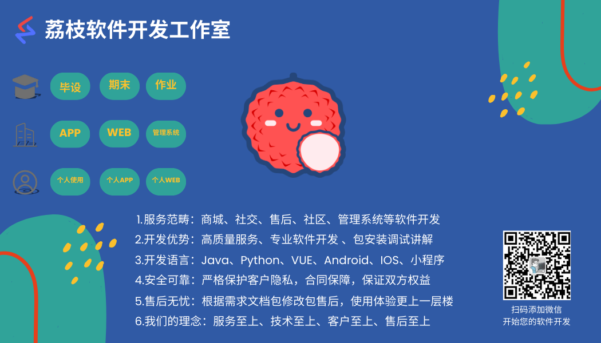

# LZ-RuoYi-App

RuoYi-App代码生成器，生成app前端单表和树表增删改查，自定义批量插入数据，在RuoYi-App、RuoYi-Vue上进行二次开发——[LZ-RuoYi-App](https://github.com/SpringSunYY/LZ-RuoYi-App)，你也可以根据教程自行实现。

其中也新做了一些组件，比如文件上传、图片上传、图片预览，集成富文本等组件，下载即可自己使用。

方便自己在做一些app的时候，可以生成一些基本的数据进行管理，不用自己新写页面。





#   LZ-RuoYi-App-v1.1.0

## 使用教程

### 1、生成配置

生成配置和若依之前生成配置一样，并未做出什么修改，可以直接根据若依的生成教程使用即可。

### 2、预览代码

此处只展示生成的代码，具体效果可跳转展示效果查看。

#### 树表


#### 单表

单表有两种展示方式，一种普通的列表展示，一种表格的展示。


### 3、生成文件


## 展示效果

### 1、单表新增


实现了文件上传、图片上传、文件上传以及富文本和字典，功能和若依vue的web端生成一致，功能一致。

### 2、单表修改


同单表新增一致。

### 3、单表列表


### 4、单表表格


单表生成实现图片展示、字典展示，图片展示组件详细用法请看组件。

### 5、树表展示


实现了图片展示，字典。

### 6、树表新增


### 7、树表修改


## 自行实现教程

### 1、复制生成文件

复制代码generator文件下的uniapp文件至RuoYi-Vue/ruoyi-generator/src/main/resources/vm下

### 2、修改后端代码

修改getTemplateList方法代码，修改成如下即可：


```Java
    /**
     * 获取模板信息
     * @param tplCategory 生成的模板
     * @param tplWebType 前端类型
     * @return 模板列表
     */
    public static List<String> getTemplateList(String tplCategory, String tplWebType)
    {
        String useWebType = "vm/vue";
        if ("element-plus".equals(tplWebType))
        {
            useWebType = "vm/vue/v3";
        }
        List<String> templates = new ArrayList<String>();
        templates.add("vm/java/domain.java.vm");
        templates.add("vm/java/mapper.java.vm");
        templates.add("vm/java/service.java.vm");
        templates.add("vm/java/serviceImpl.java.vm");
        templates.add("vm/java/controller.java.vm");
        templates.add("vm/xml/mapper.xml.vm");
        templates.add("vm/sql/sql.vm");
        templates.add("vm/js/api.js.vm");
        if (GenConstants.TPL_CRUD.equals(tplCategory)) {
            templates.add(useWebType + "/index.vue.vm");
            templates.add("vm/uniapp/uni-index.vue.vm");
            templates.add("vm/uniapp/uni-table-index.vue.vm");
            templates.add("vm/uniapp/uni-add.vue.vm");
            templates.add("vm/uniapp/uni-edit.vue.vm");
        } else if (GenConstants.TPL_TREE.equals(tplCategory)) {
            templates.add(useWebType + "/index-tree.vue.vm");
            templates.add("vm/uniapp/uni-tree-index.vue.vm");
            templates.add("vm/uniapp/uni-tree-add.vue.vm");
            templates.add("vm/uniapp/uni-tree-edit.vue.vm");
        } else if (GenConstants.TPL_SUB.equals(tplCategory)) {
            templates.add(useWebType + "/index.vue.vm");
            templates.add("vm/java/sub-domain.java.vm");
            templates.add("vm/uniapp/uni-index.vue.vm");
            templates.add("vm/uniapp/uni-table-index.vue.vm");
            templates.add("vm/uniapp/uni-add.vue.vm");
            templates.add("vm/uniapp/uni-edit.vue.vm");
        }
        return templates;
    }
```

修改getFileName方法代码，修改成如下即可：


```Java
    /**
     * 获取文件名
     */
    public static String getFileName(String template, GenTable genTable)
    {
        // 文件名称
        String fileName = "";
        // 包路径
        String packageName = genTable.getPackageName();
        // 模块名
        String moduleName = genTable.getModuleName();
        // 大写类名
        String className = genTable.getClassName();
        // 业务名称
        String businessName = genTable.getBusinessName();

        String javaPath = PROJECT_PATH + "/" + StringUtils.replace(packageName, ".", "/");
        String mybatisPath = MYBATIS_PATH + "/" + moduleName;
        String vuePath = "vue";
        String uniappPath = "uniapp";

        if (template.contains("domain.java.vm")) {
            fileName = StringUtils.format("{}/domain/{}.java", javaPath, className);
        }
        if (template.contains("sub-domain.java.vm") && StringUtils.equals(GenConstants.TPL_SUB, genTable.getTplCategory())) {
            fileName = StringUtils.format("{}/domain/{}.java", javaPath, genTable.getSubTable().getClassName());
        } else if (template.contains("mapper.java.vm")) {
            fileName = StringUtils.format("{}/mapper/{}Mapper.java", javaPath, className);
        } else if (template.contains("service.java.vm")) {
            fileName = StringUtils.format("{}/service/I{}Service.java", javaPath, className);
        } else if (template.contains("serviceImpl.java.vm")) {
            fileName = StringUtils.format("{}/service/impl/{}ServiceImpl.java", javaPath, className);
        } else if (template.contains("controller.java.vm")) {
            fileName = StringUtils.format("{}/controller/{}Controller.java", javaPath, className);
        } else if (template.contains("mapper.xml.vm")) {
            fileName = StringUtils.format("{}/{}Mapper.xml", mybatisPath, className);
        } else if (template.contains("sql.vm")) {
            fileName = businessName + "Menu.sql";
        } else if (template.contains("api.js.vm")) {
            fileName = StringUtils.format("{}/api/{}/{}.js", vuePath, moduleName, businessName);
        } else if (template.contains("uni-index.vue.vm")) {
            fileName = StringUtils.format("{}/{}/{}/uni-index.vue", uniappPath, moduleName, businessName);
        } else if (template.contains("uni-table-index.vue.vm")) {
            fileName = StringUtils.format("{}/{}/{}/uni-table-index.vue", uniappPath, moduleName, businessName);
        } else if (template.contains("uni-add.vue.vm")) {
            fileName = StringUtils.format("{}/{}/{}/uni-add.vue", uniappPath, moduleName, businessName);
        } else if (template.contains("uni-edit.vue.vm")) {
            fileName = StringUtils.format("{}/{}/{}/uni-edit.vue", uniappPath, moduleName, businessName);
        } else if (template.contains("uni-tree-index.vue.vm")) {
            fileName = StringUtils.format("{}/{}/{}/uni-tree-index.vue", uniappPath, moduleName, businessName);
        } else if (template.contains("uni-tree-add.vue.vm")) {
            fileName = StringUtils.format("{}/{}/{}/uni-tree-add.vue", uniappPath, moduleName, businessName);
        } else if (template.contains("uni-tree-edit.vue.vm")) {
            fileName = StringUtils.format("{}/{}/{}/uni-tree-edit.vue", uniappPath, moduleName, businessName);
        } else if (template.contains("index.vue.vm")) {
            fileName = StringUtils.format("{}/{}/{}/index.vue", vuePath, moduleName, businessName);
        } else if (template.contains("index-tree.vue.vm")) {
            fileName = StringUtils.format("{}/{}/{}/index.vue", vuePath, moduleName, businessName);
        }
        return fileName;
    }
```

### 3、测试SQL

运行generator\测试SQL下的两个SQL来进行测试。

生成配置信息


之后点击预览，如果没错，说明自己后端没有问题，如果报错查看后端是否出现什么问题。如果没有问题直接点击生成，把文件复制到对应位置，运行生成完成出来的sql即可，注意，uniapp的js和vue的是一样的，所以复制vue下面的js即可。

### 4、复制app组件以及工具类

复制对应的文件和工具类到app对应位置。

特别的，复制新的api，


文件、图片上传、图片预览、dict-tag需要全局。

### 注意

如果自己改出现bug，生成的代码h5选择框选中确没显示勾上，在此文件下面添加

```css
uni-checkbox .uni-checkbox-input {
	border-radius: 50%;
	border: 1rpx solid rgb(149, 149, 151);
}

uni-checkbox .uni-checkbox-input.uni-checkbox-input-checked {
	border: 1rpx solid rgb(33, 177, 255);
	background-color: rgb(33, 177, 255);
}

uni-checkbox .uni-checkbox-wrapper {
	width: 100%;
}

uni-checkbox .uni-checkbox-input.uni-checkbox-input-checked:before{
	color: #FFFFFF;
}

uni-checkbox:not([disabled]) .uni-checkbox-input:hover{
	border-color: transparent;
}

```

如果组件不适合你，可以自己修改，同时欢迎大家一起修改，找到bug解决bug。

#  LZ-RuoYi-App-v2.1.0

批量插入数据和web网页生成的优化


# RuoYi -APP

#### 基于UniApp开发的轻量级移动端框架

## 平台简介

RuoYi App 移动解决方案，采用uniapp框架，一份代码多终端适配，同时支持APP、小程序、H5！实现了与[RuoYi-Vue](https://gitee.com/y_project/RuoYi-Vue)、[RuoYi-Cloud](https://gitee.com/y_project/RuoYi-Cloud)完美对接的移动解决方案！目前已经实现登录、我的、工作台、编辑资料、头像修改、密码修改、常见问题、关于我们等基础功能。

- 配套后端代码仓库地址[RuoYi-Vue](https://gitee.com/y_project/RuoYi-Vue) 或 [RuoYi-Cloud](https://gitee.com/link?target=https%3A%2F%2Fgithub.com%2Fyangzongzhuan%2FRuoYi-Cloud) 版本。
- 应用框架基于[uniapp](https://gitee.com/link?target=https%3A%2F%2Funiapp.dcloud.net.cn%2F)，支持小程序、H5、Android和IOS。
- 前端组件采用[uni-ui](https://gitee.com/link?target=https%3A%2F%2Fgithub.com%2Fdcloudio%2Funi-ui)，全端兼容的高性能UI框架。
- 阿里云折扣场：[点我进入](https://gitee.com/link?target=http%3A%2F%2Faly.ruoyi.vip)，腾讯云秒杀场：[点我进入](https://gitee.com/link?target=http%3A%2F%2Ftxy.ruoyi.vip) 
- 阿里云优惠券：[点我领取](https://gitee.com/link?target=https%3A%2F%2Fwww.aliyun.com%2Fminisite%2Fgoods%3FuserCode%3Dbrki8iof%26share_source%3Dcopy_link)，腾讯云优惠券：[点我领取](https://gitee.com/link?target=https%3A%2F%2Fcloud.tencent.com%2Fredirect.php%3Fredirect%3D1025%26cps_key%3D198c8df2ed259157187173bc7f4f32fd%26from%3Dconsole) 

## 技术文档

- 官网网站：[http://ruoyi.vip](https://gitee.com/link?target=http%3A%2F%2Fruoyi.vip)
- 文档地址：[http://doc.ruoyi.vip](https://gitee.com/link?target=http%3A%2F%2Fdoc.ruoyi.vip)
- H5页体验：[http://h5.ruoyi.vip](https://gitee.com/link?target=http%3A%2F%2Fh5.ruoyi.vip)
- QQ交流群： ①133713780(满)、②146013835
- 小程序体验


## 演示图

|  |  |  |
| ----------------------------------------------------------- | ----------------------------------------------------------- | ----------------------------------------------------------- |
|  |  |  |
|  |  |  |